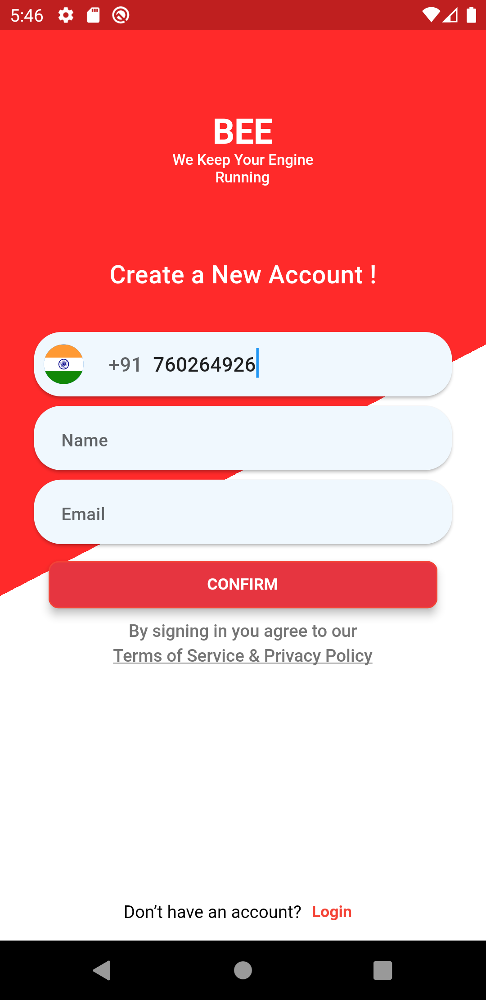
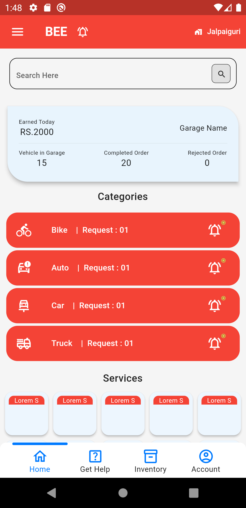
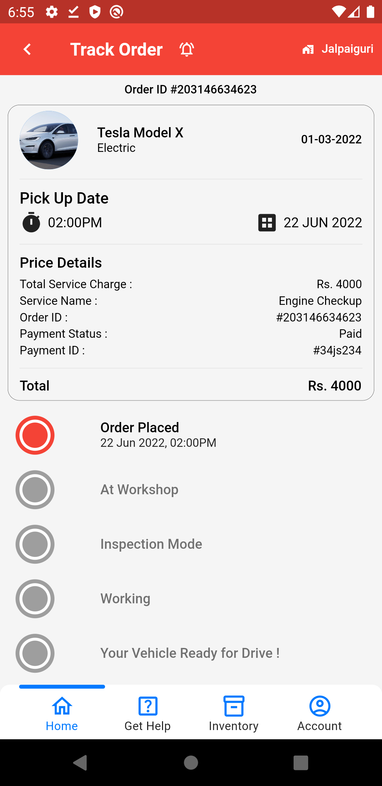
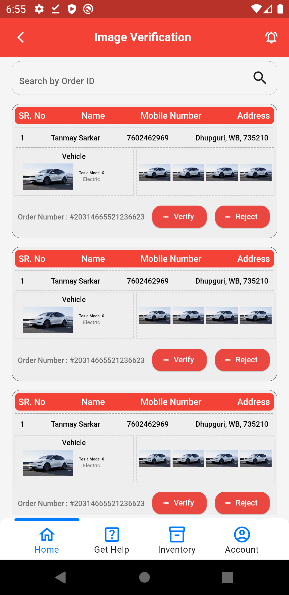

# BEE

This is a Garage App where garage mechanics and owner can manage their online booking and management of their garage.

1. Authentication Screen - Signup and Login using Firebase Auth API.
2. Home Screen - Products, Categories, etc are stored.
3. Help Screen - Informations with a form for personal issue request.
4. Product Management Screen - with Add New and Edit Option.
5. Notification Screen - Used only Provider to work along.
6. Invoice, Job Cards and many more.
7. Auto Login, Auto Logout added.
8. Many more screens are present in this project.

Tech Used : Flutter, Firebase. </br>
Packages Used : Provider - State Management,
                Shared Preferences - Storing Auth Data on Device.</br>
All dependencies :

  ```
  cupertino_icons: ^1.0.2
  country_icons: ^2.0.2
  image_picker: ^0.8.5+3
  navigation_history_observer: ^1.1.0
  location: ^4.4.0
  http: ^0.13.4
  geocoding: ^2.0.4
  dotted_border: ^2.0.0+2
  persistent_bottom_nav_bar: ^4.0.2
  provider: ^6.0.3
  expansion_tile_card: ^2.0.0
  custom_check_box: ^0.0.4
  firebase_core: ^1.18.0
  firebase_auth: ^3.3.20
  shared_preferences
```

## Screenshots

<table>
  <tr>
    <td>Signup</td>
     <td>Home</td>
     <td>Track</td>
    <td>Verification</td>
  </tr>
  <tr>
    <td></td>
    <td></td>
    <td></td>
    <td></td>
  </tr>
 </table>
